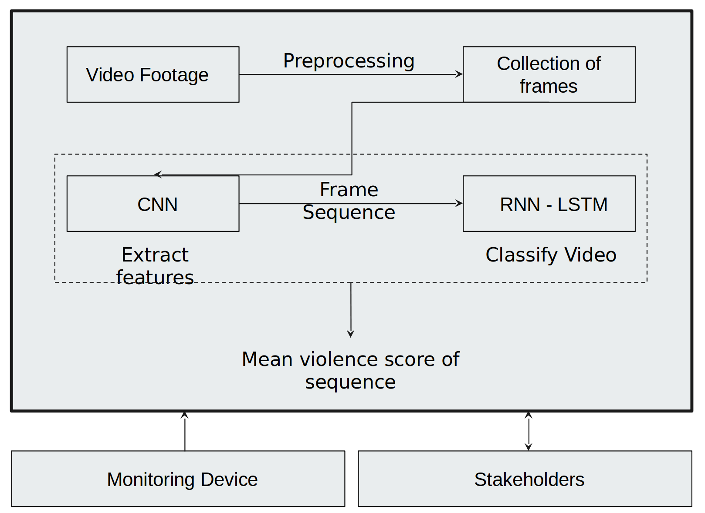
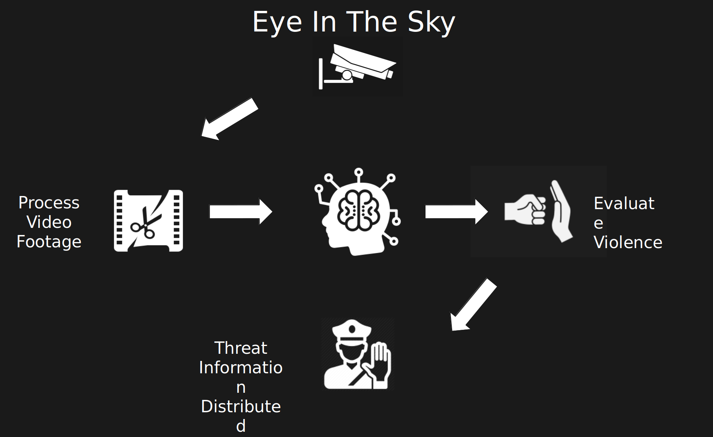

# Real-Time Violence Detection System

This project implements a real-time violence detection system using an LSTM model. It includes a web application that allows users to either upload a video or analyze violence in real-time using a camera. The results, including an analysis plot, are displayed on the UI.

## Table of Contents
- [Introduction](#introduction)
- [Architecture](#architecture)
- [Business Use Case](#business-use-case)
- [Installation](#installation)
- [Usage](#usage)
  - [Step 1: Move Files](#step-1-move-files)
  - [Step 2: Extract Files](#step-2-extract-files)
  - [Step 3: Extract Features](#step-3-extract-features)
  - [Step 4: Train Model](#step-4-train-model)
  - [Step 5: Run Web Application](#step-5-run-web-application)
- [License](#license)

## Introduction

The system processes video footage to detect violent activities in real-time. It uses a combination of Convolutional Neural Networks (CNN) and Recurrent Neural Networks (RNN - LSTM) to classify video sequences and compute a mean violence score for each sequence.

## Architecture

## Business Use Case

## Installation

To get started, clone the repository and install the required dependencies:

`git clone <repository-url>`

`cd <repository-directory>`

`pip install -r requirements.txt`

## Step 1: Move Files
Navigate to the lstm_model directory and run the 1_move_file.py script to move all files into the appropriate train/test folders.

## Step 2: Extract Files
Run the 2_extract_files.py script to extract images from the videos and create a data file for training and testing.

## Step 3: Extract Features
Navigate to the data directory inside the lstm_model folder and run extract_features.py to generate extracted features for each video.

## Step 4: Train Model
In the same data directory, run train.py to train the LSTM model. The trained model will be saved in the checkpoints directory.

## Step 5: Run Web Application
Navigate to the root directory of the project and run main.py to start the web application:
`python main.py`

Ensure the saved_model path variable in main.py points to the correct location of the trained model
